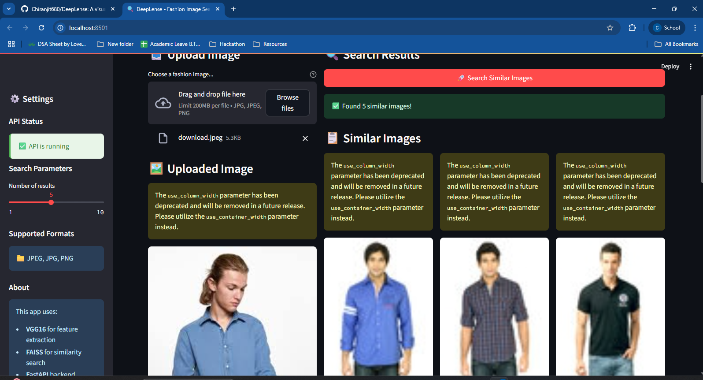
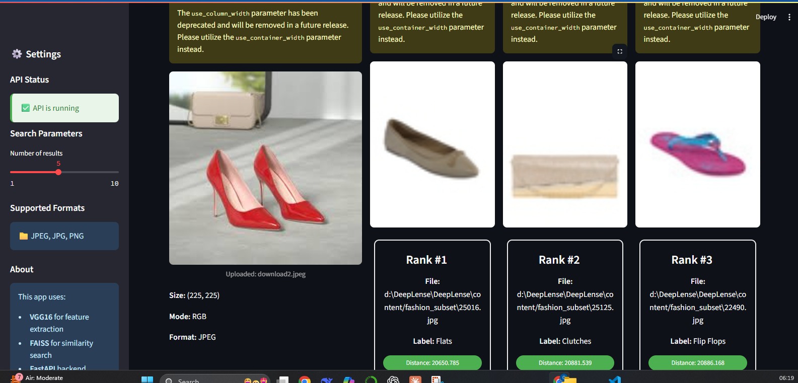

## DeepLense
 A powerful visual similarity search engine that allows users to upload fashion images and retrieve visually similar images from a dataset using deep learning–based embeddings.
- Implemented image feature extraction using a pre-trained CNN model (VGG16)
- Integrated FAISS (Facebook AI Similarity Search) for fast and accurate nearest neighbor search on high-dimensional vectors.
- Built a lightweight front-end using Streamlit for user-friendly image upload and result visualization.
- Enabled metadata handling with .pth and .pkl files to store filenames and vector indices

🛠️ Tech Stack:
1. Pytorch
2. FastAPI
3. FAISS
4. Streamlit
5. NumPy & Pandas
6. Matplotlib

